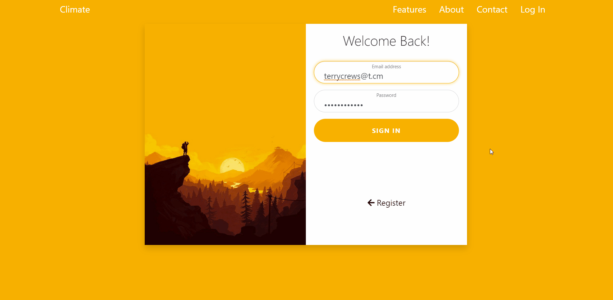
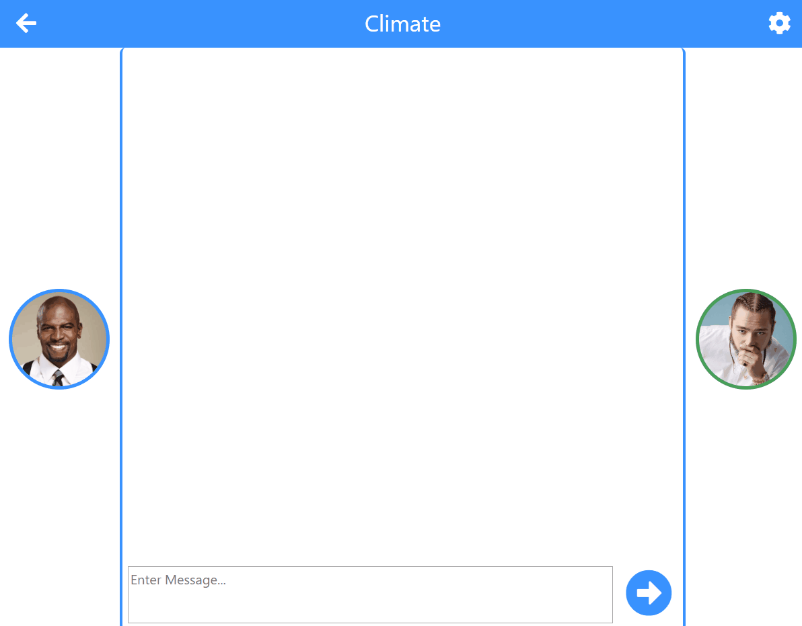

# Cimate
Climate was a 2 person project completed as part of my Software Engineering module. The idea of the web app was to allow 2 users to video chat,
text chat and transfer files to one another, all via client to client connection accomplished through the use of WebRTC. I was over the design
and front-end of the app while Andrew worked on integrating webRTC and setting up both the models and database. Unfortunatly, the idea
was to large scale for us to complete so its functionality is largly incomplete. However, I designed an initial prototype of the app (using html,
css and javascript) which can be found in the Website_Prototype folder. I later converted these into the .hbs files for the project.

# Prototype Demo
##### Home/Landing 

##### Sign In/Up 

##### Users Home/Dashboard 

##### Text Chat 

